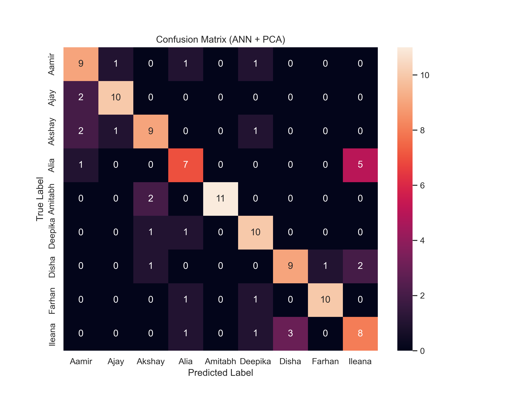
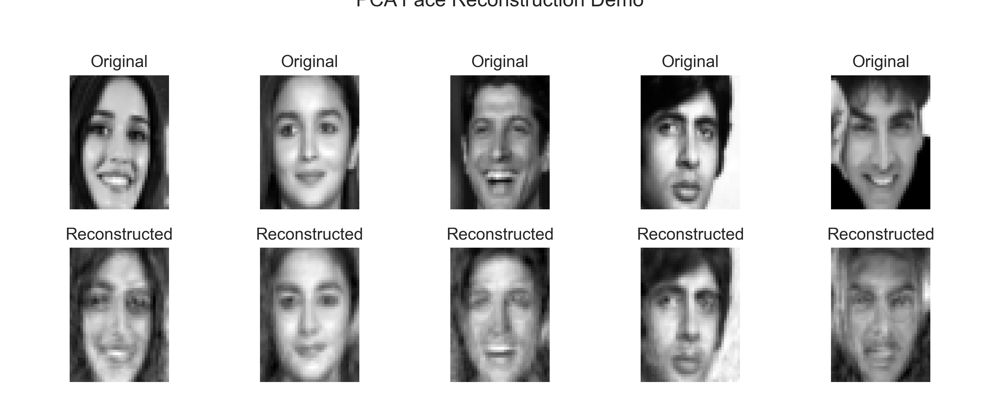

# Implementation of PCA with ANN algorithm for Face recognition

[](LICENSE.unknown)

A machine learning project for **face recognition** using **Principal Component Analysis (PCA)** for dimensionality reduction and **Artificial Neural Networks (ANN)** for classification.

---

##  Features
- **PCA** for extracting principal components from face images.
- **ANN** for classifying faces into different identities.
- **Face reconstruction demo** to visualize PCA performance.
- **Confusion matrix** to evaluate classification results.

---

##  Results

### Confusion Matrix


### PCA Face Reconstruction Demo


---

##  Project Structure
```
Project/
│-- Face Recognition using PCA + ANN.ipynb        # Main Jupyter Notebook
│-- requirements.txt                              # Dependencies
│-- LICENSE                                       # MIT License
│-- README.md                                     # Project Documentation
│-- images/                                       # Output images (confusion matrix, PCA reconstruction)
```

---

##  Installation

1️. Clone this repository:
```bash
git clone https://github.com/Ananthan3117/Project---Implementation-of-PCA-with-ANN-algorithm-for-Face-recognition.git
cd Project---Implementation-of-PCA-with-ANN-algorithm-for-Face-recognition
```

2️. Install dependencies:
```bash
pip install -r requirements.txt
```

️3. Run the Jupyter Notebook:
```bash
jupyter notebook Face Recognition using PCA + ANN.ipynb
```

---

##  How It Works
1. **Data Preprocessing**: Load and normalize grayscale face images.
2. **PCA Transformation**: Reduce dimensionality while retaining important features.
3. **ANN Training**: Train a neural network on the PCA-reduced dataset.
4. **Evaluation**: Visualize confusion matrix and reconstruction results.

---

##  License
This project is licensed under the **MIT License** - see the [LICENSE](LICENSE.unknown) file for details.

---

##  Author
**Ananthakrishnan A L**  
ananthan31117@gmail.com  
[GitHub Profile](https://github.com/yourusername)
